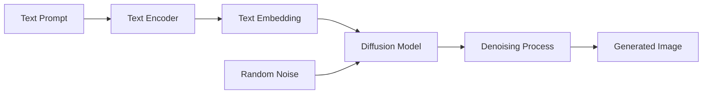

# Image Generation
{: .no_toc }

Text-to-image generation using pre-trained diffusion models for creative and experimental applications.
{: .fs-6 .fw-300 }

## Table of contents
{: .no_toc .text-delta }

1. TOC
{:toc}

---

## Overview

### What is Image Generation?

Image generation allows users to create images from text descriptions using AI models. This system supports **text-to-image** generation, where a natural language prompt is converted into a visual image.

**Key Concept**:
- **Prompt**: A text description of what you want to generate (e.g., "a cat playing with a ball")
- **Model**: A pre-trained neural network that understands the relationship between text and images
- **Generation**: The process of creating a new image based on the text prompt

### Why Image Generation?

**Use Cases**:
1. **Creative Design**: Generate concept art, illustrations, or visual ideas
2. **Prototyping**: Quickly visualize ideas without manual drawing
3. **Content Creation**: Generate images for presentations, blogs, or social media
4. **Experimentation**: Explore AI capabilities and model behavior

**Technical Benefits**:
- **No Manual Drawing Required**: Generate images from text descriptions
- **Rapid Iteration**: Quickly try different prompts and parameters
- **Creative Exploration**: Discover unexpected visual combinations
- **Accessibility**: Enable image creation without artistic skills

### How It Works

**Core Technology**: **Diffusion Models** (e.g., Stable Diffusion)

Diffusion models learn to generate images by gradually removing noise from random noise, guided by text prompts.

**Basic Workflow**:



**Process**:
1. **Text Encoding**: Convert the text prompt into a numerical embedding
2. **Noise Initialization**: Start with random noise
3. **Iterative Denoising**: Gradually remove noise, guided by the text embedding
4. **Image Generation**: After multiple steps, a coherent image emerges

---

## Features

### Core Capabilities

- **Text-to-Image**: Input a text description, generate a corresponding image
- **Pre-trained Models**: Uses state-of-the-art models like Stable Diffusion
- **Parameter Control**: Adjust generation parameters (steps, guidance scale, etc.)
- **GPU Acceleration**: Supports local inference with GPU acceleration

### Supported Models

- **Stable Diffusion**: High-quality, open-source diffusion model
- **Custom Models**: Can be extended to support other diffusion models

---

## Usage Guide

### Basic Usage

1. Navigate to the "🖼️ Image Generation" tab in the Web UI
2. **Enter Text Prompt**: Type a descriptive text (e.g., "a serene landscape with mountains and a lake at sunset")
3. **Optional: Adjust Parameters**:
   - **Steps**: Number of denoising steps (more steps = higher quality, slower)
   - **Guidance Scale**: How closely to follow the prompt (higher = more adherence)
   - **Seed**: Random seed for reproducibility
4. **Generate**: Click the "Generate Image" button
5. **View Results**: The generated image will be displayed

### Example Prompts

**Simple Objects**:
- "a red apple on a white table"
- "a blue bird flying in the sky"

**Complex Scenes**:
- "a futuristic cityscape at night with neon lights and flying cars"
- "a peaceful garden with cherry blossoms and a traditional Japanese bridge"

**Artistic Styles**:
- "a watercolor painting of a sunset over the ocean"
- "a digital art piece of a cyberpunk street scene"

---

## Technical Implementation

### Architecture

**Components**:
- **Text Encoder**: Converts text prompts into embeddings (e.g., CLIP text encoder)
- **Diffusion Model**: The core generative model (e.g., Stable Diffusion UNet)
- **VAE Decoder**: Converts latent representations to pixel images

### Libraries

- **Hugging Face `diffusers`**: Provides pre-trained diffusion models and inference pipelines
- **PyTorch**: Deep learning framework for model execution
- **Transformers**: Text encoding and model loading

### Code Example

```python
from diffusers import StableDiffusionPipeline
import torch

# Load pre-trained model
pipe = StableDiffusionPipeline.from_pretrained(
    "runwayml/stable-diffusion-v1-5",
    torch_dtype=torch.float16 if torch.cuda.is_available() else torch.float32
)
pipe = pipe.to("cuda" if torch.cuda.is_available() else "cpu")

# Generate image
prompt = "a cat playing with a ball"
image = pipe(prompt, num_inference_steps=50, guidance_scale=7.5).images[0]

# Save image
image.save("generated_image.png")
```

### Performance Considerations

- **GPU Memory**: Diffusion models require significant GPU memory (4GB+ for Stable Diffusion)
- **Inference Time**: Generation typically takes 5-30 seconds depending on steps and hardware
- **Model Size**: Pre-trained models are large (several GB), require initial download

---

## Best Practices

### Prompt Engineering

**Effective Prompts**:
- **Be Specific**: "a red sports car" is better than "a car"
- **Include Details**: Add style, mood, composition details
- **Use Descriptive Language**: "serene", "dramatic", "vibrant" can influence results

**Common Patterns**:
- **Subject + Style**: "a cat, digital art style"
- **Subject + Mood**: "a forest, mysterious atmosphere"
- **Subject + Composition**: "a mountain, wide angle view"

### Parameter Tuning

- **Steps**: 
  - Lower (20-30): Faster, may have artifacts
  - Higher (50-100): Slower, better quality
  - Recommended: 50 steps for balance

- **Guidance Scale**:
  - Lower (1-5): More creative, less prompt adherence
  - Higher (7-15): More prompt adherence, may be less creative
  - Recommended: 7.5 for most cases

---

## Troubleshooting

### Generation Failures

**Problem**: Model fails to generate or produces errors.

**Solutions**:
- **Check GPU Memory**: Ensure sufficient VRAM (4GB+)
- **Reduce Image Resolution**: Lower resolution requires less memory
- **Reduce Steps**: Fewer steps use less memory and time
- **Use CPU Mode**: Fallback to CPU if GPU unavailable (much slower)

### Poor Quality Results

**Problem**: Generated images are blurry, distorted, or don't match the prompt.

**Solutions**:
- **Increase Steps**: More denoising steps improve quality
- **Improve Prompt**: Make prompt more specific and descriptive
- **Adjust Guidance Scale**: Try higher values for better prompt adherence
- **Try Different Seeds**: Random seed can significantly affect results

### Slow Generation

**Problem**: Image generation takes too long.

**Solutions**:
- **Use GPU**: GPU acceleration is essential for reasonable speed
- **Reduce Steps**: Fewer steps = faster generation
- **Lower Resolution**: Smaller images generate faster
- **Optimize Model**: Use optimized model variants (e.g., `diffusers` optimized versions)

---

## Related Resources

- [Stable Diffusion Paper](https://arxiv.org/abs/2112.10752)
- [Hugging Face Diffusers Documentation](https://huggingface.co/docs/diffusers)
- [Prompt Engineering Guide](https://www.promptingguide.ai/techniques/imagegeneration)
